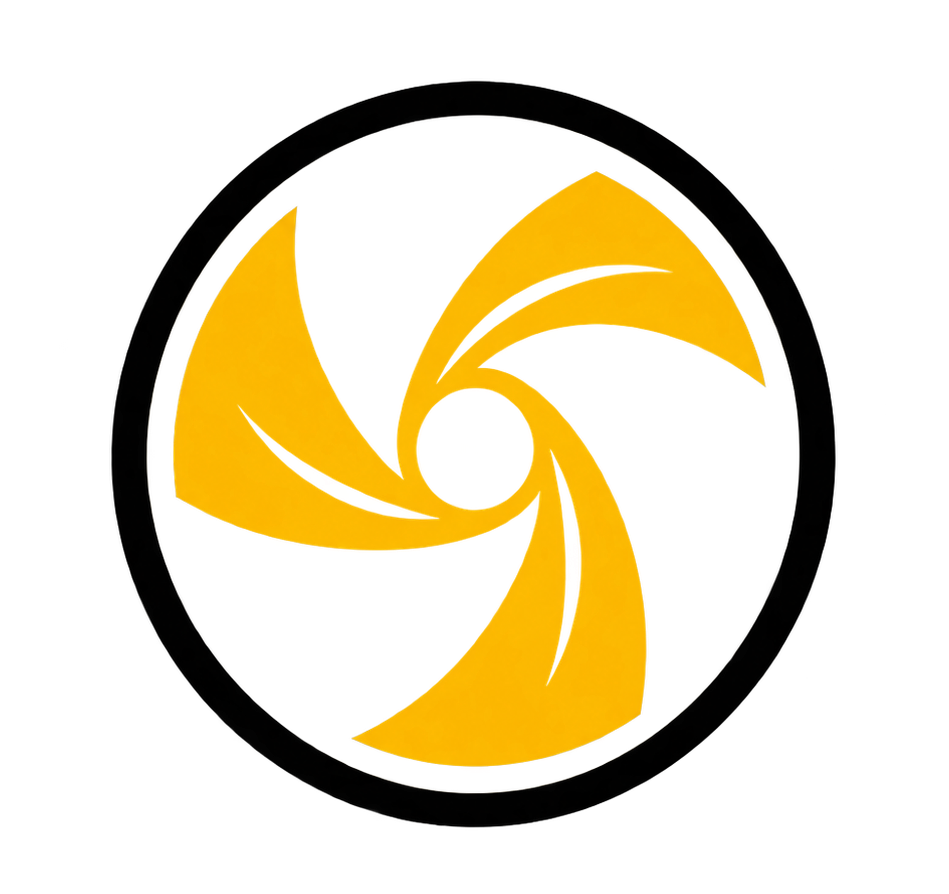

<p align="center">
  
</p>

# StemLab

StemLab is a Windows and Linux application and VST3 for separating music into
vocals, drums, bass, guitar, piano, and other stems, with direct Ableton Live
integration on Windows and direct REAPER integration on Linux.

The repository contains the source-development workflow. It deliberately does
not contain generated builds, model weights, virtual environments, or installer
packaging.

## Features

- JUCE Standalone application and VST3
- BS-RoFormer, Demucs `htdemucs_6s`, and hybrid separation
- Optional kick-bleed refinement
- Adaptive vocal, drum, and foreground stem trees
- File, physical-input, and system-audio capture (WASAPI loopback on Windows,
  PipeWire/PulseAudio monitor on Linux)
- Waveform preview and selective export
- Direct import into Ableton through `StemLabRemote` (Windows)
- In-process REAPER integration on Linux - no scripts or extensions to install

## Set Up Development

StemLab currently targets 64-bit Windows and Python 3.11. Install:

- Visual Studio with **Desktop development with C++** and CMake tools
- Python 3.11
- FFmpeg on `PATH` when working with compressed audio
- An NVIDIA/CUDA setup for practical model inference

From an ordinary PowerShell window in the repository root:

```powershell
.\scripts\setup_dev.ps1
```

This creates `.venv`, installs StemLab plus its development/recursive
dependencies, and runs the unit tests. The first install is large because the
audio backends depend on PyTorch and pretrained-model tooling.

To reuse a different environment:

```powershell
.\scripts\setup_dev.ps1 -EnvironmentPath C:\path\to\venv
```

## Linux

Linux builds natively and needs no venv or system Python for the backend:

```bash
./plugin/build_linux.sh          # Standalone + VST3
./plugin/install_vst3.sh         # -> ~/.vst3
./install_backend_linux.sh       # self-contained Engine + auto-discovery
```

Inside REAPER, StemLab talks to the host directly: **Use Selected Item** reads
the selected arrangement item and **Insert Stems** creates colour-coded stem
tracks under the source track, aligned with the original selection. See
`LINUX_BUILD.md` for dependencies, the REAPER workflow, and where StemLab
writes files.

## Build And Run

Build the Standalone application and VST3:

```powershell
.\scripts\build_plugin.ps1
```

The script finds Visual Studio, downloads the pinned JUCE source when needed,
and performs an incremental Release build. Use `-Clean` only when you need to
discard the CMake build directory.

Run the Standalone app:

```powershell
& ".\plugin\build\StemLabPlugin_artefacts\Release\Standalone\StemLab.exe"
```

Install the development VST3 and Ableton Remote Script:

```powershell
.\scripts\install_ableton.ps1
```

The installer asks for administrator permission to copy the VST3 into the
standard Windows plug-in folder. It never closes Ableton automatically.

See [docs/ableton.md](docs/ableton.md) for Ableton configuration.

## Test

`tests/` is the unit-test suite and should stay in source control. Run it after
every behavior change:

```powershell
.\.venv\Scripts\python.exe -m pytest -q
```

The tests use synthetic audio, so they do not download model weights or require
Ableton.

## How It Fits Together

```text
JUCE button / host audio
        |
        v
PluginEditor -> PluginProcessor -> stemlab-plugin-job
                                      |
                                      v
                                  pipeline.py
                           /          |          \
                    RoFormer       Demucs       Hybrid
                           \          |          /
                                      v
                                  WAV stems
                                      |
                        Plugin preview / StemLabRemote
```

- `PluginEditor` owns controls, layout, and waveforms.
- `PluginProcessor` owns capture, playback, child processes, and bridge state.
- `stemlab/plugin_job.py` translates between JUCE arguments and Python.
- `stemlab/pipeline.py` chooses the separation engine and optional refinement.
- `stemlab/recursive.py` routes adaptive child-stem operations.
- `StemLabRemote` is the only code allowed to manipulate Ableton tracks/clips.

The module and runtime reference is in [docs/development.md](docs/development.md).

## Command Line

After setup, separation can also run without the JUCE app:

```powershell
.\.venv\Scripts\stemlab-separate.exe `
    --input "song.wav" `
    --output ".\output"
```

Use `--engine roformer`, `--engine demucs`, or `--engine hybrid`. Add
`--no-refine` to keep the raw model output.

## Repository Map

```text
docs/                    Development, Ableton, and licensing notes
integrations/ableton/    Ableton Live control-surface bridge
plugin/                  JUCE C++ frontend, assets, and CMake definition
scripts/                 Development setup, build, and install commands
stemlab/                 Python separation and DSP engine
tests/                   Fast unit tests using generated audio
pyproject.toml           Python package, commands, and tool settings
LINUX_BUILD.md           Linux build, install, and REAPER guide
```

Directories such as `.venv/`, `.portable-cache/`, `plugin/build/`, `dist/`,
`__pycache__/`, and `.vs/` are generated locally and ignored by Git. Edit only
the source files listed above.

## License

StemLab's original code is MIT licensed. JUCE, FFmpeg, model runtimes, and
pretrained checkpoints retain their own terms; see
[docs/third-party.md](docs/third-party.md).
