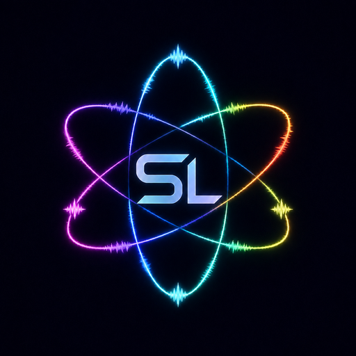

<p align="center">
  
</p>

# StemLab

StemLab is an open-source six-stem music separator for Windows with a JUCE
Standalone application and Ableton Live VST3 integration.

It separates audio into:

- Vocals
- Drums
- Bass
- Guitar
- Piano
- Other

StemLab supports **BS-RoFormer**, **Demucs `htdemucs_6s`**, and a **Hybrid**
mode that combines both model outputs before optional StemLab refinement.

## Features

- Windows Standalone application
- Ableton Live VST3
- BS-RoFormer separation
- Demucs six-stem separation
- Hybrid RoFormer + Demucs fusion
- Optional adaptive StemLab refinement
- NVIDIA CUDA acceleration
- MP3/WAV/FLAC/OGG/AIFF input through FFmpeg normalization
- Resizable, volume-colored waveform previews
- Stem Play/Pause and click-to-seek auditioning
- Windows system-audio recording
- Selective stem export
- Selective Ableton stem import
- Invisible `StemLabRemote` Ableton integration
- No Max for Live device required

## Download for Windows

For normal users, install StemLab from the **GitHub Releases** page rather than
downloading the source repository. The Windows installer bundles the tested
StemLab runtime, including FFmpeg, so users do not need to install Python or
FFmpeg separately.

Download `StemLab-Setup-0.9.9.exe` from the latest release and run it. If that
release also contains `StemLab-Setup-0.9.9-*.bin` files, download those files to
the same folder as the EXE before starting setup.

The installer can install the desktop application and, optionally, the Ableton
Live VST3 + `StemLabRemote` integration.

### For developers

This repository contains source code only. Large assembled runtime files such
as `Engine/ffmpeg.exe` belong in `dist/` and GitHub Release assets, not in git
history.

Build the Windows installer with:

```powershell
.\build_installer_windows.ps1
```

If FFmpeg is not on PATH, point the builder at the executable you want to ship:

```powershell
.\build_installer_windows.ps1 -FfmpegPath "C:\path\to\ffmpeg.exe"
```

That script first builds the portable payload under:

```text
dist\StemLab-0.9.9-Windows\
```

The portable builder copies a working `ffmpeg.exe` from PATH into the generated
`Engine/` folder. You may select a specific redistributable binary instead:

```powershell
.\build_portable_windows.ps1 -FfmpegPath "C:\path\to\ffmpeg.exe"
```

To build and publish/update the GitHub Release, install GitHub CLI, authenticate
once with `gh auth login`, then run:

```powershell
.\publish_github_release.ps1
```

The publisher uploads the setup EXE and any Inno Setup `.bin` slices. Add
`-IncludePortableZip` if you also want the portable ZIP on the release.

> **FFmpeg licensing:** StemLab's MIT license does not replace FFmpeg's license.
> Before distributing the bundled binary, verify that the particular FFmpeg
> build you chose is redistributable under its own configuration/license terms.
> The build automatically writes `FFMPEG_BUILD_INFO.txt` into the release to
> record the exact FFmpeg configuration being shipped.

## Separation Engines

Choose an engine from:

```text
Settings > Separation Engine
```

### BS-RoFormer

Uses `bs-roformer-infer` with the configured six-stem pretrained checkpoint.

### Demucs

Uses upstream Demucs with `htdemucs_6s`.

### Hybrid

Runs BS-RoFormer and Demucs sequentially, compares their stem estimates in the
spectral domain, and fuses them before optional StemLab refinement.

The models run sequentially to limit peak GPU-memory pressure.

## StemLab Refinement

The optional refinement stage currently focuses on reducing kick/drum bleed in
non-drum stems.

It:

1. detects likely kick events,
2. finds isolated source examples,
3. builds a reference,
4. matches that reference in STFT space,
5. estimates a constrained complex transfer,
6. subtracts only matched components,
7. gates processing by confidence/similarity.

The process is intentionally conservative: preserving legitimate musical
content takes priority over removing every trace of bleed.

## Standalone Workflow

1. Open or drag an audio file into `StemLab.exe`.
2. Choose the separation engine.
3. Enable or disable StemLab refinement.
4. Click **Separate All Stems**.
5. Audition the completed stem waveforms.
6. Select the stems you want to save.

StemLab can also capture the current Windows playback mix using WASAPI
loopback.

## Ableton Live

StemLab uses two pieces inside Ableton:

```text
StemLab.vst3
StemLabRemote
```

For installation, see:

```text
ABLETON_QUICKSTART.md
```

Typical workflow:

1. Add StemLab to an audio track.
2. Select an Arrangement audio clip.
3. Click **Use Live Clip**.
4. Click **Separate All Stems**.
5. Audition the completed stems.
6. Check the stems you want.
7. Click **Send Selected**.

`StemLabRemote` creates the selected Arrangement tracks/clips underneath the
source track.

## Building From Source

Development currently targets **Python 3.11 on Windows**.

Install the Python backend:

```powershell
python -m pip install -e .
```

Build the JUCE Standalone + VST3 targets:

```powershell
cd plugin
.\build_windows.ps1
```

Outputs are written under:

```text
plugin\build\StemLabPlugin_artefacts\Release\
```

including:

```text
Standalone\StemLab.exe
VST3\StemLab.vst3
```

To build the complete self-contained Windows package, run this from the
repository root:

```powershell
.\build_portable_windows.ps1
```

The nested JUCE build is path-independent and always uses `plugin\CMakeLists.txt`,
regardless of the shell's current working directory.

The portable builder creates:

```text
dist\StemLab-0.9.9-Windows\
dist\StemLab-0.9.9-Windows.zip
```

The portable release intentionally excludes development environments, build
caches, tests, source-control metadata, model checkpoints, and other local
development files.

## Command Line

Basic separation:

```powershell
stemlab-separate --input "song.wav" --output ".\output"
```

Skip StemLab refinement:

```powershell
stemlab-separate --input "song.wav" --output ".\output" --no-refine
```

Refine an existing six-stem directory:

```powershell
stemlab-refine --stems ".\stems" --output ".\refined"
```

## Project Structure

```text
StemLab/
├── ableton_remote/       Ableton Remote Script
├── assets/               Repository artwork
├── plugin/               JUCE VST3 + Standalone source
│   ├── Resources/        Embedded application artwork
│   └── Source/
├── scripts/              Development/smoke-test utilities
├── stemlab/              Python separation backend
│   └── refinement/
├── tests/                Automated source tests
├── build_portable_windows.ps1
├── PORTABLE_INSTALL.txt
├── ABLETON_QUICKSTART.md
├── pyproject.toml
├── LICENSE
├── THIRD_PARTY.md
└── README.md
```

## Pretrained Models

StemLab does not commit pretrained checkpoint bytes to this repository.

Weights are downloaded separately by their respective backends when required.
Individual model checkpoints may have attribution, redistribution, or usage
terms separate from StemLab's source-code license.

## License

StemLab's original source code is released under the **MIT License**.

Third-party frameworks, libraries, runtimes, and pretrained models retain their
own licenses and terms. See `THIRD_PARTY.md` and `plugin/LICENSE-NOTE.md`.

## Version

Current version: **0.9.9**

This version includes the portable runtime architecture and the embedded
StemLab / StemLab Windows application artwork while retaining the current
multi-engine separation, Ableton integration, waveform, recording, and
refinement workflow.


### JUCE download/cache

`plugin\build_windows.ps1` downloads the pinned JUCE 9.0.0 source archive into:

```text
.portable-cache\JUCE-9.0.0\
```

and passes that extracted source directly to CMake. Git is not required for the
JUCE build step.

If a JUCE download is interrupted, rerun the build. The script retries transient
download failures and removes a corrupt cached archive if extraction fails.
